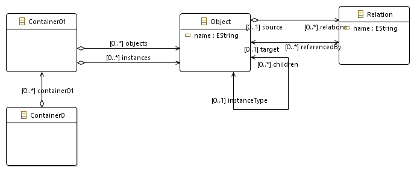
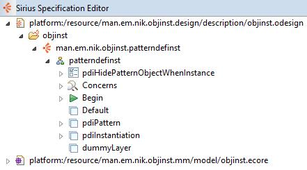
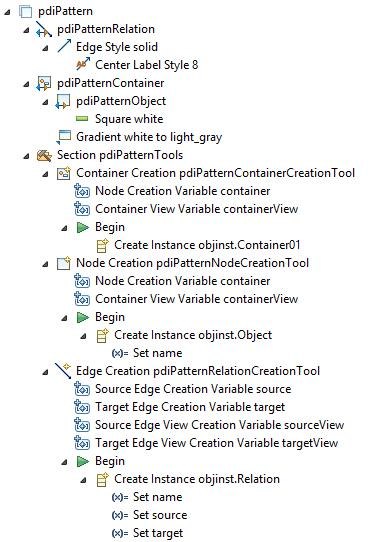
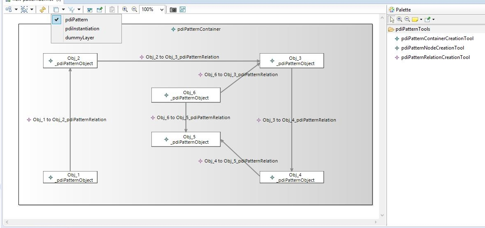
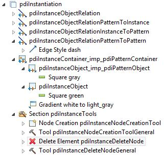
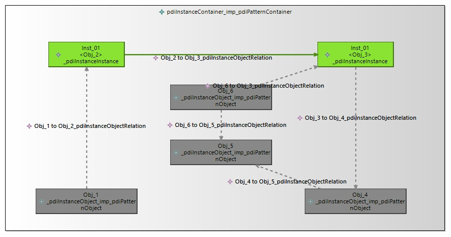
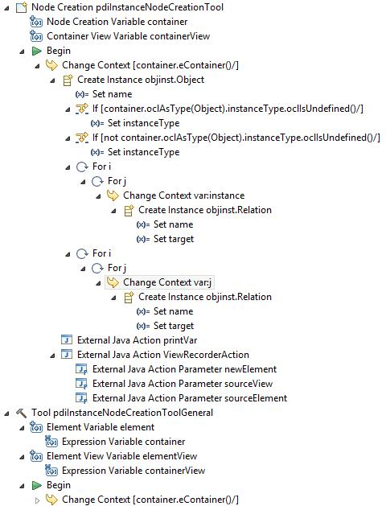
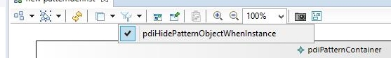
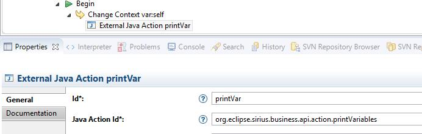

# SiriusPatternInstanceEditorExample
This is an example Eclipse editor implemented with EMF and Sirius.
The basic idea is to be able to create a pattern in the form of a (very simplified) class diagram and then instantiate elements from the pattern. One of the main challenges here is to preserve the (user-defined via point&click) layout of the pattern when instantiating (and deleting) objects.

This example is by no means complete or a good example of how such editor should be implemented. It is just a minimal example that demonstrates a lot of Sirius features.

This is not a beginner tutorial. Basic knowledge of EMF and Sirius is required.

## Metamodel
*Ecore Modeling Project* (man.em.nik.objinst.mm). You can use either the *Entities* representation (Sirius Perspective active) to graphically work with the model or use the *Sample Ecore Model Editor* for a tree view of the metamodel.
Reload the *genmodel file and generate Model, Edit, and Editor code. Refer to EFM documentation for working with Ecore.

The metamodel is defined in Ecore as follows:
 <br/>
The root element is Container0. Contains one or more Container01 objects.
Container01 has two containment references:
 - *objects* holds a list of Objects which (with their respective relations) is essentially the pattern
 - *instances* holds a list of Objects each of which references Objects from the "objects" list
Object is a class that represents the Nodes in our class diagram. Although the metamodel does not enforce it, Objects in the "objects" list  are part of the pattern and are considered to be an InstaceType (It can be instantiated) and must therefore not have an instanceType. It will, however have zero or more "children" (instances). Respectively, Objects in the "instances" list are instances of Objects in the "objects" list and must have (reference) an instanceType and have no children.
Relations are contained in Objects and represent the connections in our diagram. 
Although relations cannot be explicitely instantiated they are replicated when instantiating an object.

The behavior and restrictions described for the above metamodel are implemented in the Sirius editor.
Again, the metamodel is not best suited for the example but is simple enough to not distract from the implementation of the editor.

## Sirius

*Viewpoint Specification Project* (man.em.nik.objinst.design). 

### Overview of editor specification
We have two layers - one for the pattern diagram and one for the instance.
The pattern layer defines mappings or Container01, Object (pattern), and Relation, as well as tools for interacting with the diagram (creating elements)
The Instance layer reuses mappings from pattern layer for Container01, Object (pattern), and Relation. Additionally define mappings for Object (instances) and relations between instances as well as between instances and pattern objects.

Mappings are rules that specify which semantic elements are displayed in the diagram and how.
The main idea behind reusing mappings is that the layout of the pattern is preserved. (We could instead, and that might be a better way of doing it, create and independent layer or even a diagram and copy the layout of the pattern layer into the instance layer. That, however, requires more work.)

Labels for elements include the name of the mapping so that it is easier to recognize which graphical element is contributed by which mapping.

 <br/>

### pdiPattern

 <br/><br/><br/>
 <br/>

### pdiInstantiation

Imported mappings are named with "imp" in the name. They are basically a redifinition of the mappings with a reference to the original. Since we are redefining them we can change the definition and/or appearance. In general the layout/position of the imported elements is preserved which is what we are aiming for. 
We have two Object mappings - one for instance objects and one for imported pattern objects.
The *Semantic Candidate Expression* for the imported pattern object mapping is simply 
```
feature:objects
```
This will always show the pattern element even when we have instances. However, that is not the behaviors we want. For better overview we want to hide the pattern object when an instance object is present. We could redefine the *Semantic Candidate Expression* above as
```
[self.obejcts->select(o: Object | o.children->size() = 0/]
```
This will only show objects that have not been instantiated yet. Or rather, since the objects already exist in our pattern, Sirius will destroy them as soon as an instance is created, and recreate them when all instances are deleted. That way unfortunately the recreated element is placed "randomly" on the diagram and the layout of the pattern is lost. Instead of destroying the element we want to just hide it. For that purpose a filter is used (explained later).

We have four Relation mappings - instance to instance; pattern to pattern; instance to pattern; pattern to instance. The first one uses a solid line whereas the other three use dashed line (different style) as those relations are from the pattern and not instances themselves. It should be possible to combine the last three relations into one mapping, however, I decided to keep them separate and use simple model query expressions in the specification.

 <br/><br/><br/>
 <br/>

#### Tools

Tools allow the user to interact with the diagram in some way. Tools could make contributions to the Palette (sidebar), the context menu, or define what happens when elements are dragged&dropped, double-clicked, etc.

With the instantiation tool we want to be able to click an object and create a copy of that object, respectively replicate all its connections.
For the sake of illustration there are two tools for instantiating objects. The first is a node creation tool. It automatically creates a node view for the created semantic element. The second is a general purpose tool which in general does not create any views (but those can be explicitly created in the specification), however, when a mapping is synchronized (Advanced Tab in the Properties view) views will be created and deleted by Sirius automatically to reflect the state of the model. That is why we can reuse (by means of copy&paste) the same definition for those two tools. There is a slight difference though. The *Node Creation Tool* provides access to the semantic and graphical elements the user clicks on via the variables "container" and "containerView", while the general purpose tool uses "element" and "elementView". To make the definitions compatible we add an Expression Variable to "element" named "container" with the value of "element", effectively creating an alias. The same is done respectively for "elementView".
Another important difference between the tools is that the *Node Creation Tool* should in general be used on *Container Views* (the user is expected to click on an empty space within a container). However, we want to use the tool an a *Node View* (pattern Object). To make it possible in the Advanced tab we add an Extra Mapping. And to disable the tool on the container view, since we have no use for that we add a precondition
```
[container.oclIsKindOf(Object)/]
```

 <br/><br/><br/>
 <br/>

### Filters

Filters allow the user to hide elements from the diagram by activating them from the toolbar to get a better overview, and then bring back those elements in their original form and position by deactivating the filter.

 <br/>

In our case, we want to use the filter to provide a specific editor behavior, namely, hide pattern object views when an object is instantiated. For consistency we want this filter to be always active. There is no such option in Sirius yet. There is something called "Concerns" which could be used to specify that a filter is active by default, but that does not prevent the user from disabling it.
To achieve the desired behavior we use ModelChangeTriggers to react to changes in the diagram, such as deactivating a filter, activating a layer, moving a graphical element, etc.

### ModelChangeTrigger, Automatically activate a filter

Define a custom ModelChangeTrigger
``` Java
public class AutoActivateFilter implements ModelChangeTrigger {
...
public static final NotificationFilter IS_LAYER_ACTIVATED = new NotificationFilter.Custom() {

		public boolean matches(Notification input) {
			if (input.getFeature() instanceof EReference
					//&& "activatedFilters".equals(((EReference)input.getFeature()).getName())
					//&& input.getNewValue() instanceof CompositeFilterDescription || input.getNewValue() == null
					&& input.getNotifier() instanceof DSemanticDiagram){
				return true;
			}
			return false;
		}
	};
 ...
  @Override
	public Option<Command> localChangesAboutToCommit(
			Collection<Notification> arg0) {
   ...
   activateCommand = activateFilter(dSemDiagram, filterName);
				if (activateCommand != null) {
					return Options.newSome(activateCommand);
				}
    ...
```
In general we would want to react only to changes in the "activatedFilters" feature, which would indicate that a filter was (de)activated. But since no change occurs there when the diagram is first created and we want to active the filter the trigger checks the state whenever the notifier is the diagram and activates the filter if necessary.

Don't forget to register the trigger in Activator.java
``` Java
newSession.getEventBroker().addLocalTrigger(AutoActivateFilter.IS_LAYER_ACTIVATED, new AutoActivateFilter(newSession));
```

### ModelChangeTrigger, Automatically deactivate a (conflicting)
 layer

Similarly to the Filter behavior we want to be able to activate and deactivate layers that don't "play" well together. By default the user can (de)activate any number of layers at the same time. But we want to keep certain things separated. For example, we want to have the designing of the pattern and the instantiation as well as the respective tools to be separated. (One would preferably create different diagrams to keep concerns separate, but then you'd have to play with custom layouts algorithms and copying layout information)
We register a ModelChangeTrigger that will deactivate a list of "conflicting" layers. The conflicting layers are hardcoded in the the trigger itself:
``` Java
Map<String, List<String>> conflictingLayers = new HashMap<String, List<String>>();
		conflictingLayers.put("pdiPattern", Arrays.asList((new String[] {"pdiInstantiation", "dummyLayer"})));
		conflictingLayers.put("pdiInstantiation", Arrays.asList((new String[] {"pdiPattern"})));		
		conflictingLayers.put("dummyLayer", Arrays.asList((new String[] {"pdiPattern"})));
```

### External Java Action
External Java Actions are a way to extend the editor's functionality via Java.
An External Java Action class implements IExternalJavaAction. It must be registered in the Extensions tab of plugin.xml. It can then be used by its ID in the specification of the diagram.
An important java action that already exists in Sirius is org.eclipse.sirius.business.api.action.printVariables which prints out to the console the available variables and their values in a certain context. Invaluable for debugging.



### ToDo
There is no trivial way to set the position (coordinates) of a view on the diagram, which is somewhat of a WTF, with this being a framework for creating visual representations and the location is somewhat an important part of it.
Why is this a problem?
When an object is instantiated, ideally, we want the element to initially be placed where the original object was. Instead Sirius places it "randomly" according to some default layouting algorithm.
You could define a custom layout algorithm for the "Arrange All" function but that is used when you actually click on the button in the toolbar. I might as well just move the element.
I tried using a ModelChangeTrigger, which looks for a newly created view for the corresponding semantic element and then tries to apply the coordinates of the view that was clicked by the user (coordinates recorded via a java action). And for a short moment you see the element being placed where we want it but then Sirius moves it according to its layouting algorithm.
Needs investigation.

